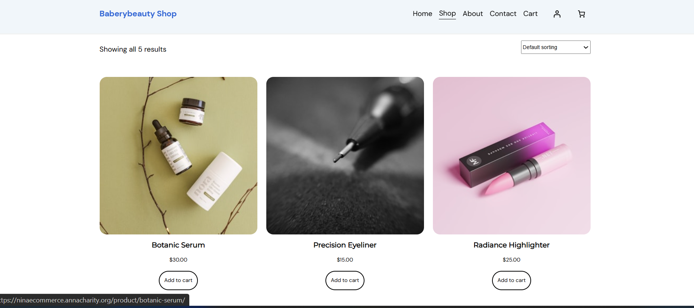
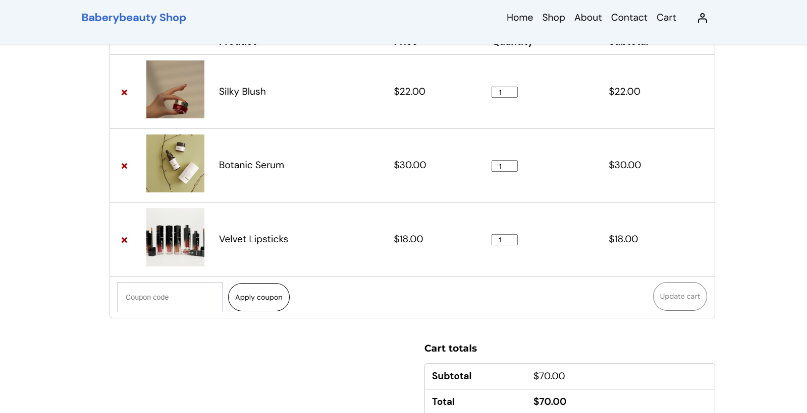

# Nina's E-Commerce Store

## Student Information
| **Field** | **Details** |
|-----------|-------------|
| **Student Name** | Nina Umukundwa |
| **Student ID** | 23844/2024 |
| **Course** | E-Commerce And Web Application Course (EWA408510) |
| **Academic Year** | 2025-2026 \| Semester: II |
| **Lecturer** | Eric Maniraguha |
| **Submission Date** | 27 June 2026 |

---

## Project Title
**Nina's E-Commerce Store** - A Modern Online Shopping Platform

---

## Platform Used
| **Component** | **Details** |
|---------------|-------------|
| **Platform** | WordPress with WooCommerce |
| **Theme** | Customized WordPress Theme |
| **Live Website** | [https://ninaecommerce.annacharity.org/](https://ninaecommerce.annacharity.org/) |

---

## Features Implemented

### 1. Homepage Features
- Hero section with engaging banner and call-to-action buttons
- Featured products display for popular/special items
- Category navigation for easy browsing
- Search bar for quick product discovery
- Fully responsive design for all devices

### 2. Product Pages
- High-quality product images with zoom capability
- Comprehensive product descriptions and specifications
- Clear pricing with currency formatting
- Add to cart functionality
- Product variations (size, color, and other options)
- Related products for cross-selling

### 3. Shopping Cart
- Cart management (add, remove, update quantities)
- Automatic price calculation (subtotal and total)
- Coupon/Discount code application
- Streamlined checkout process
- Shipping calculator

### 4. Contact Page
- User-friendly inquiry form
- Business information (address, phone, email)
- Operating hours display
- Location mapping integration

### 5. Additional Features
- User registration and login
- Order history and tracking
- Secure payment processing
- Email notifications for orders

---

## Screenshots

### 1. Homepage

*The main landing page featuring hero section, categories, and featured products.*

### 2. Product Page

*Detailed product view with specifications, variations, and add-to-cart functionality.*

### 3. Cart Page

*Shopping cart overview with quantity controls and total calculations.*

---

## Challenges Faced

| **Challenge Type** | **Description** | **Solution** |
|--------------------|-----------------|--------------|
| **Theme Customization** | Adapting WordPress theme to match desired design | Extensive CSS modifications and child theme creation |
| **Performance** | Slow loading times with high-quality images | Implemented caching plugins and lazy loading |
| **Mobile Responsiveness** | Ensuring seamless display across devices | Regular testing and responsive design adjustments |
| **WooCommerce Configuration** | Setting up product variations and attributes | Detailed WooCommerce documentation study |
| **Payment Gateway** | Secure payment processing setup | SSL implementation and payment gateway testing |
| **Security** | Protecting customer data and transactions | Security plugins and regular updates |

---

## Lessons Learned

### Technical Skills
- **WordPress Development**: Deep understanding of WordPress architecture, hooks, filters, and theme development
- **WooCommerce Management**: Configuration and customization of e-commerce functionalities
- **Responsive Design**: Creating mobile-friendly interfaces with media queries
- **Plugin Integration**: Selecting and configuring appropriate plugins for specific features
- **Performance Optimization**: Implementing caching, CDN, and image optimization techniques

### E-Commerce Knowledge
- **User Experience**: Understanding intuitive navigation and user-friendly interfaces
- **Conversion Optimization**: Identifying elements that influence customer purchasing decisions
- **Inventory Management**: Effective product categorization and organization
- **Security Best Practices**: SSL certificates, secure payment processing, and data protection

### Professional Development
- **Project Management**: Planning and executing a complete e-commerce project
- **Documentation**: Creating comprehensive project documentation using Markdown
- **Problem Solving**: Systematic approaches to overcoming technical challenges
- **Version Control**: Using Git and GitHub for project management and documentation

---

## Live Website & Repository

| **Type** | **Link** |
|----------|----------|
| **Live Website** | [https://ninaecommerce.annacharity.org/](https://ninaecommerce.annacharity.org/) |
| **GitHub Repository** | [https://github.com/nina7824/e-commerce/](https://github.com/nina7824/e-commerce/) |

---

## Repository Structure
e-commerce/
├── README.md # Project documentation
├── images/ # Screenshots folder
│ ├── homepage.png
│ ├── product-page.png
│ ├── cart-page.png
│ └── contact-page.png
└── [WordPress Files] # Website source files

**Date**: 27 June 2026

---

## Acknowledgments
- **Lecturer**: Eric Maniraguha for guidance and support
- **WordPress Community**: For extensive documentation and resources
- **WooCommerce**: For providing a robust e-commerce platform

---
